<picture>
  <source media="(prefers-color-scheme: dark)" srcset="assets/header-dark.svg">
  
</picture>

<samp>
  <a href="https://www.linkedin.com/in/pradhan-ashu/">linkedin</a> ·
  <a href="https://x.com/criox4">x</a>
</samp>

full-stack engineer. i build llm agents that touch real money, the backtesting and execution systems behind them, and the dev tools i wish existed.

most of it lives in private or client repos, so the green squares are real but the code isn't here. below is what it does, and source links where the code is public.

### agents

- **termix**: solana dex with an mcp-powered trading agent. every tool is rated L1 read / L2 write / L3 moves-funds, and L3 needs explicit user sign-off. keys held in aws/gcp kms. 2.6k commits.
- **a solana defi agent**: chat to swap, add liquidity and bridge (jupiter, raydium, layerswap). transactions go out as jito bundles, and simulation errors are mapped to plain english before anything signs. *(nda)*
- **an enterprise rag platform**: pre-egress dlp audits every outbound model call. retrieval p95 < 1.2s. has an air-gapped mode that falls back to local ollama, tesseract and whisper. *(nda)*

### trading infra

- **[dquant](https://github.com/criox4/dquant-backend)**: natural language → validated json dsl → backtest. the llm never writes executable code. rewrote the backend from express to fastify and cut one endpoint from 41 queries to 1.
- **[bnb lp range rebalancer](https://github.com/criox4/BNB-LP-Range-Rebalancer)** and **[bnb grid trader](https://github.com/criox4/bnbGridTrader)**: small, readable on-chain strategy bots.

### tools & side projects

- **[devwatch](https://github.com/criox4/DevWatch)**: vs code extension for managing ports and processes, plus an mcp server so claude code can kill your stray `node` for you. ~10–30ms activation, <1% cpu. on the marketplace and open vsx.
- **[photobooth](https://photobooth.criox4.xyz)**: browser photostrip editor. phone-to-laptop transfer over p2p webrtc in < 5s. [`source`](https://github.com/criox4/photobooth)
- **homelab**: proxmox, adguard, caddy and authelia behind a cloudflare tunnel with zero inbound ports.

 

  
  
  
  
  
  
  
  
  
  

<samp>earlier: sih 2022 national finalist (uidai track) · 2nd at gupshup conversational messaging hackathon</samp>
